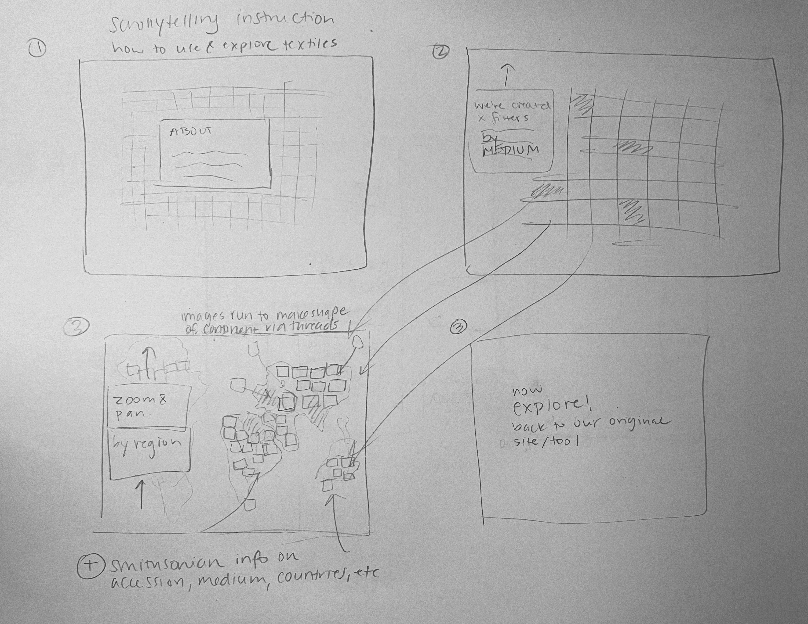

# textiles_ms1 Part III
ms1 project pt. 3 on textiles in the Smithsonian
## Sketch 1: Map of Smithsonian Textile Collection

**Description**:  
A map where textiles are "threaded" from their original countries' to the Smithsonian musuems they are held at today. The map animates with a timeline.

- **Animation**:
  - Textiles appear over time showing their origin country and "threaded" with thin lines to the Smithsonian museums in the U.S. 
- **Image Link**:
  - 

---

## Sketch 2: Cards Revealing Process and Techniques

**Description**:  
Each textile card, upon click, reveals a visual showing the process and technique used to create that textile, to encourage learning and curiousity of the methods used to create these materials.
- **Animation**:
  - Card flip is a simple and smooth animation meant to engage the user. The "show all" at a glance view allows for dragging to pan and zoom.
- **Image Link**:
  - 

---

## Sketch 3: Scrollytelling & Instruction

**Description**:  
We use scrollytelling to provide a tutorial and introduction to textiles as material culture, the different mediums that make up the collection at the Smithsonian, where these textiles come from, etc, and show the user how they can begin their exploration. In this we also want to highlight the Smithsonian's critical conservation work. 

- **Animation**:
  - Smooth and engaging scrollytelling effects: for introducing medium/material type, we want all the images to be slightly transparent, and have the textiles that are of each material fade in as we scroll. For example, the user will scroll and read about how many cotton textiles there are and those cotton textiles will be highlighted in the full at a glance grid. For region, we will provide some historical context and as the user scrolls and learns about X textiles from Y continent, those textiles will be "threaded" and form the shape of that continent to effectively create a map. The "show all" view is also zoomable and users can drag the screen to pan around.
- **Image Link**:
  - 

---

## Additional Notes

- **Color Scheme**: [Optional details about color scheme]
- **Typography**: [Optional details about fonts or text styling]
- **User Flow**: [Optional description of how each scroll interaction ties the sketches together]
